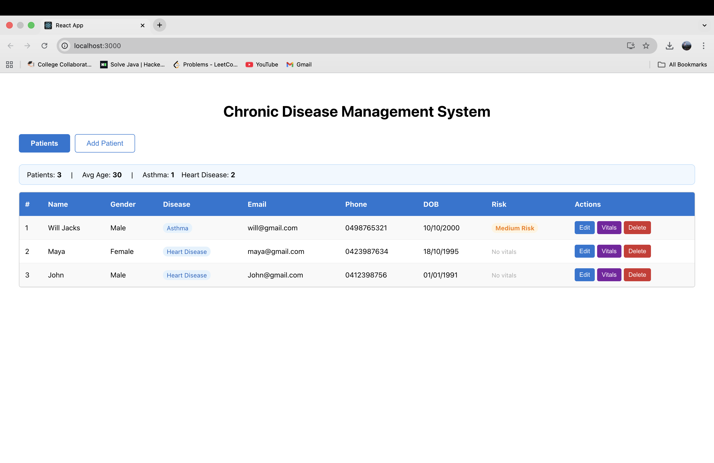
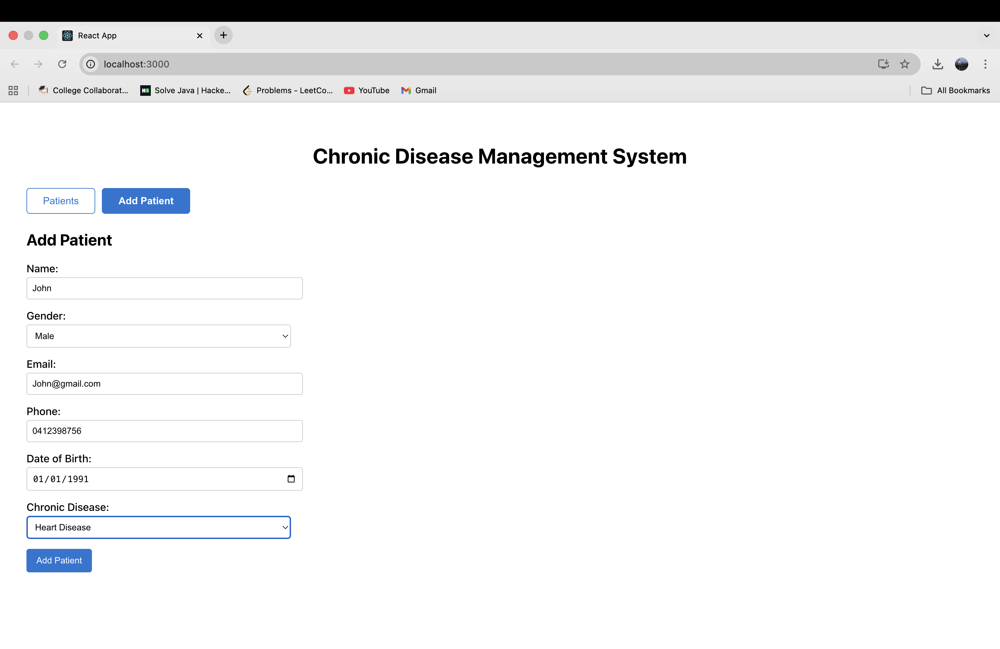
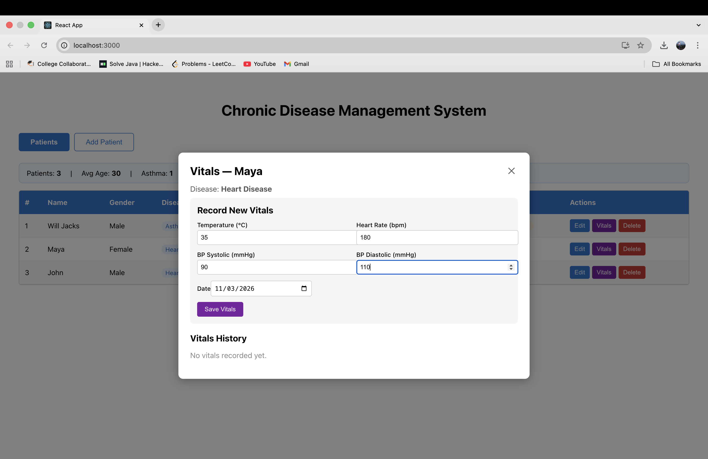

# Chronic Disease Management System

A **full-stack healthcare management application** built with **React and ASP.NET Core Web API** that enables healthcare providers to manage patient records, monitor vitals, and assess health risks.

🔗 Repository: https://github.com/Karumudi-Karthika/chronic-disease-management

---

## Screenshots

### Patients Table


### Add Patient


### Vitals & Risk Indicator


---

## Features

- ✅ Add, edit, and delete patient records
- ✅ Track chronic disease per patient (Diabetes, Hypertension, Asthma, etc.)
- ✅ Record and monitor patient vitals (temperature, heart rate, blood pressure)
- ✅ Automatic **risk assessment** — Low / Medium / High based on vitals
- ✅ Patient metrics dashboard (total patients, average age, disease breakdown)
- ✅ Form validation (Australian phone, Gmail, date of birth)
- ✅ Confirmation dialog before deleting
- ✅ Success/error notifications
- ✅ Tab navigation (Patients / Add Patient / Edit Patient)

---

## Tech Stack

### Frontend
- React, Axios, JavaScript / HTML / CSS

### Backend
- ASP.NET Core Web API (.NET 10)
- Entity Framework Core
- SQLite

---

## Project Structure

```
chronic-disease-management/
├── Backend/
│   ├── Controllers/
│   │   ├── PatientsController.cs
│   │   └── VitalsController.cs
│   ├── Data/
│   │   └── ChronicDbContext.cs
│   ├── Models/
│   │   ├── Patient.cs
│   │   └── Vital.cs
│   ├── Program.cs
│   ├── appsettings.json
│   └── Backend.csproj
├── src/
│   ├── components/
│   │   ├── ConfirmationDialog.js
│   │   └── Notification.js
│   ├── pages/
│   │   ├── Patients.js
│   │   └── AddOrEditPatient.js
│   ├── services/
│   │   └── api.js
│   └── App.js
├── screenshots/
├── public/
├── package.json
└── README.md
```

---

## API Endpoints

### Patients
| Method | Endpoint | Description |
|--------|----------|-------------|
| GET | /api/patients | Get all patients |
| GET | /api/patients/{id} | Get patient by ID |
| POST | /api/patients | Add new patient |
| PUT | /api/patients/{id} | Update patient |
| DELETE | /api/patients/{id} | Delete patient |

### Vitals
| Method | Endpoint | Description |
|--------|----------|-------------|
| GET | /api/vitals?patientId={id} | Get vitals for a patient |
| POST | /api/vitals | Add new vitals |
| PUT | /api/vitals/{id} | Update vitals |
| DELETE | /api/vitals/{id} | Delete vitals |

---

## Running Locally

### Prerequisites
- [.NET 10 SDK](https://dotnet.microsoft.com/download)
- [Node.js](https://nodejs.org/)

### 1. Clone the Repository
```bash
git clone https://github.com/Karumudi-Karthika/chronic-disease-management
cd chronic-disease-management
```

### 2. Run the Backend
```bash
cd Backend
dotnet restore
ASPNETCORE_ENVIRONMENT=Development dotnet run
```
Backend: **http://localhost:5000**  
Swagger UI: **http://localhost:5000/swagger**

### 3. Run the Frontend
```bash
cd ..
npm install
npm start
```
Frontend: **http://localhost:3000**

---

## Risk Assessment Logic

| Condition | Risk Level |
|-----------|------------|
| BP Systolic > 140 OR multiple abnormal readings | 🔴 High Risk |
| BP Systolic > 120 OR one abnormal reading | 🟡 Medium Risk |
| All readings within normal range | 🟢 Low Risk |
